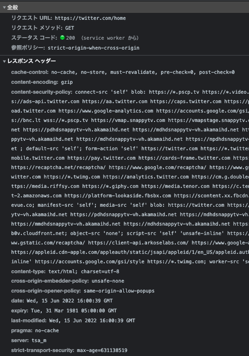

# 課題 1（質問）

## キャッシュって？

キャッシュする(Caching)とは、キャッシュ可能(Cacheable)なレスポンスを、リクエストに紐付けてキャッシュ領域(Cache Storage)に保存(Store)すること。保存されたレスポンスをキャッシュされたレスポンス(Stored Response)といい、それが再利用(Reuse)されることがいわゆるキャッシュヒット(Cache Hit)となる。

## キャッシュのメリット・デメリット

### メリット

- ロード時間短縮
- データ通信量節約

### デメリット

- デバイス容量圧迫
- 更新が反映されないことがある

---

## 1. キャッシュが必要な理由

1. ロード時間短縮やデータ通信量節約のメリットがありユーザー体験向上に役立つ。モバイルデバイスの普及により、いつでもどこでも、高品質・高解像度・高速表示の Web サイトやアプリ配信が求められる現代には必須の機能。
2. オリジンサーバーの負荷分散、ひいてはコスト削減になる。台風の情報サイトのような、台風が来ていない期間や冬にはほぼアクセスゼロで、非常時に急激な流入があるサイトなどでも、キャッシュがヒットしサーバに Request が来なければ、 CPU 処理、メモリアクセス、ディスクアクセス、ネットワークアクセス全て無しでサービスが提供できるため、従量課金のクラウドでは予算の削減にもダイレクトに繋がる。サービス規模が大きいほど経済的メリットも大きい。
3. オリジンサーバーとの距離が遠い場合に RTT を減らせるなど

## 2. キャッシュヒット率とは？向上するには？

1. データ読み込み時に、必要なデータがキャッシュに存在する割合
2. キャッシュヒット率の向上にはコンテンツの性質に応じた HTTP ヘッダの設定が必要

## 3. キャッシュの種類とそれぞれの違い

1. Private Cache: クライアント側に保存してパーソナライズしたコンテンツを保存・再利用できる
2. Shared Cache: オリジンサーバー・クライアント間のサーバーに保存して共有コンテンツを保存・再利用できる
   - Shared Cache 管理者の違いにおける分類
     - Proxy Cache（サービス提供者が直接管理できない）
     - Managed Cache（サービス提供者が直接管理できる）
       - リバースプロキシ（gateway、ロードバランサー、WAF とも）
       - CDN

## 4. キャッシュ制御用の HTTP ヘッダ

### 簡易表

| Header                                     | Req | Res | Summary                                           |
| ------------------------------------------ | --- | --- | ------------------------------------------------- |
| `Cache-Control`                            | o   | o   | キャッシュ制御用ディレクティブを指定できる        |
| `If-Match`, `If-None-Match`                | o   | x   | リクエストを条件付き（Conditional Request）にする |
| `If-Modified-Since`, `If-Unmodified-Since` | o   | x   | リクエストを条件付き（Conditional Request）にする |
| `Etag`                                     | x   | o   | リソースの識別子を指定できる（Entity Tag）        |
| `Last-Modified`                            | x   | o   | リソースの最終更新日時を返す                      |

### 詳細

- `Cache-Control`

  - `no-store`: キャッシュを保存しないようにする
  - `no-cache`: リクエストごとにキャッシュを検証する
  - `public`: 任意のキャッシュに保存できるようにする
  - `private`: プライベートキャッシュにのみ保存できるようにする
  - `max-age`: レスポンスを再利用できる期間を指定する（開始地点はオリジンサーバーでレスポンスが生成されたとき）
  - `s-maxage`: 共有キャッシュにおけるレスポンスを再利用できる期間を指定する（`max-age`両方存在する場合`s-maxage`が優勢となる）
  - `must-revalidate`: オリジンサーバー側で有効期限の検証に成功しないと、起源切れキャッシュを使えないようにする
  - `proxy-rebalidate`: `must-revalidate`と同等（共有キャッシュにのみ適用される）
  - etc...

- `If-Match`, `If-None-Match`, `If-Modified-Since`, `If-Unmodified-Since`

  - `If-Match`の場合: このリクエストヘッダの値に`etag`を指定し、レスポンスに含まれる`Etag`ヘッダと合致すれば、条件付きリクエストが成功する
  - `If-None-Match`の場合: このリクエストヘッダの値に`etag`を指定し、レスポンスに含まれる`Etag`ヘッダと合致しなければば、条件付きリクエストが成功する
  - modified も似たような感じなので省略

- `Etag`, `Last-Modified`
  - 簡易表の通り（ConditioanlRequest の検証の際に使用される）

## 5. キャッシュサイズ上限について

### 簡易表（オフィシャルのリソースはなし）

| ブラウザ | 容量上限            | 容量オーバー時の挙動                                                                |
| -------- | ------------------- | ----------------------------------------------------------------------------------- |
| Chrome   | ディスク容量の 80%? | 上限を下回るまで LRU アルゴリズムで使用頻度が低いものからオリジン単位で消されていく |
| FireFox  | ディスク容量の 50%? | 上限を下回るまで LRU アルゴリズムで使用頻度が低いものからオリジン単位で消されていく |
| Edge     | ディスク容量の 80%? | 上限を下回るまで LRU アルゴリズムで使用頻度が低いものからオリジン単位で消されていく |
| Safari   | デフォルトで 1GB    | 200MB ずつ上限 UP、ただし 7 日間訪問がなければ自動削除                              |

[参照 - web.dev](https://web.dev/i18n/ja/storage-for-the-web/)

### 認識の整理

- 上限の感覚値を得る
  - 原則はデバイスのストレージ容量依存なものが多い
    - 現代では 〜数十 GB くらいまではほとんど問題なさそう
    - サービス開発や運営の際に、ユーザーのキャッシュ上限を気にすることもなさそう
- 上限を超えるとどうなるか知る
  - 基本自動削除（ほぼ気にしてくていいじゃんってくらいに最適化されてる印象）
  - IE 系は削除せずに、書き込みを制御する
    - サポート終了したから関係ないという幸せ
- ブラウザ差分の認識
  - Chrome, FireFox, Edge はユーザーが上限を設定可能で上限が極端に少ない可能性もある
  - IE は論外として Safari だけはちょっと特殊
    - 期間指定が効かないのか？

## 6. 動的サイトのキャッシュに Exprise を使わない方がいい理由

- 動的なサイトではリソースの更新頻度が高いので、定期的に検証を行いたいため
- そもそも絶対時間指定には以下の問題があるため。
  - オリジンサーバーとクライアントのシステム時計が同期されていないと成り立たない
    - インターネット上ではそんなこと保証できない
  - 時刻のフォーマット（ex. Thu, 01 Dec 1994 16:00:00 GMT）は、以下のような考慮すべき点が多くサーバーの実装も複雑になりバグが発生しやすい
    - 時差
    - サマータイム
    - うるう秒

### 補足

現在は、TTL を相対時間指定できるように、`Cache-Control`ヘッダに`max-age`レスポンスディレクティブが導入されている。オリジンサーバーによりレスポンスが生成されてから経過した時間を`Age`として、`max-age=60`の場合、Age が 60s までの間はレスポンスは新鮮（Fresh）、それ以降は古い（Stale）とみなすというのが、現代のキャッシュの文脈における有効期限の概念。

HTTP/1.0 までは`Exprise`ヘッダが使用されてきたが、今は`max-age`と同時指定すると`max-age`が優勢になる。Cookie も同じ。

よってそもそも絶対時間指定は後方互換性のために残置されているという認識でよいはず。動的・静的に関わらず`max-age`を使った方がいい気がしている。

## 7. 実運用されているサービスのキャッシュを３例以上確認する

### Zenn


#### トップページ

リクエストごとにキャッシュを検証する、条件付きリクエスト、条件合致せず`304 Not Modified`レスポンス

- `cache-control: max-age=0`
- `if-none-match: "27b82-IBpzyF86RXAxBCokiZlDdamn39M"`
- `ステータスコード: 304`

#### その他

- **CSS ファイル**: 1 年間共有キャッシュに保存する、不変、弱い検証を行う
  - `cache-control: public, max-age=31536000, immutable`
  - `etag: W/"xxxx"`
  - `last-modified: xxxx`
- **jpeg ファイル（ユーザーアイコンなど）**: ７日間プライベートキャッシュに保存する、不変、中間サーバーの変更を認めない
  - `cache-control: private, no-transform, immutable, max-age=604800`
  - `etag: W/"xxxx"`

### DevelopersIO


#### トップページ

５分間キャッシュを保存する

- `cache-control: max-age=300`

### Twitter



#### トップページ

- `cache-control: no-cache, no-store, must-revalidate, pre-check=0, post-check=0`
- `pragma: no-cache`

no-store が優勢になるため、MDN では無意味な例として紹介されている（[参照](（https://developer.mozilla.org/ja/docs/Web/HTTP/Headers/Cache-Control#%E6%A0%BC%E7%B4%8D%E3%82%92%E9%98%B2%E6%AD%A2)）
⇨ YouTube のトップページでも同様の設定だったが、コンシューマーサービスでは何か有効な面があるのかな？

追記: helmet.js, fastify-diablecache などのライブラリでは、以下の設定を手当たり次第に盛り込んでいるみたい

```
Cache-Control: no-store, no-cache, must-revalidate, proxy-revalidate
Pragma: no-cache
Expires: 0
Surrogate-Control: no-store
```

何の意味があるのかについては「よくわかんないけど、いろんな実装をサポートするため」らしい

1. https://github.com/helmetjs/nocache/issues/19
2. https://github.com/Fdawgs/fastify-disablecache/issues/131
