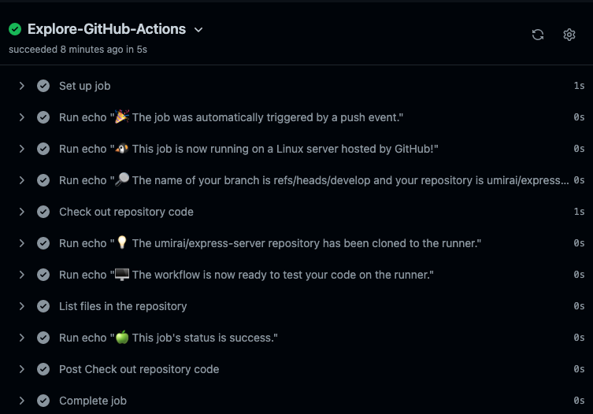
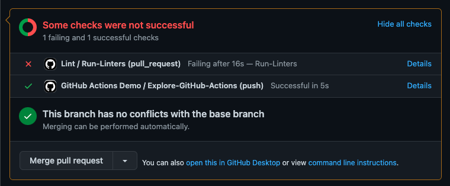
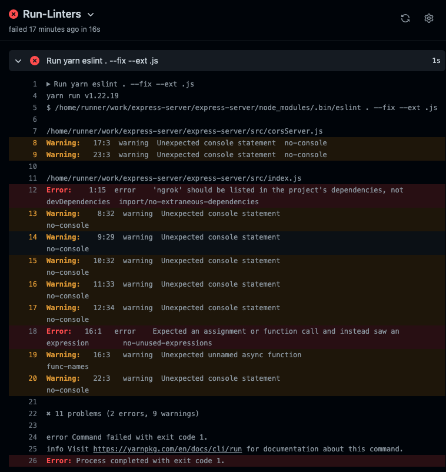

# Task1

GitHub Actions で PR 作成時に自動で ESLint を実行するように実装した。

[GitHub: express-server](https://github.com/umirai/express-server)

## 1.公式の `workflow` デモを実装してみる

- デモファイルを追加

```yml
# .github/workflows/github-actions-demo.yml
name: GitHub Actions Demo
on: [push]
jobs:
  Explore-GitHub-Actions:
    runs-on: ubuntu-latest
    steps:
      - run: echo "🎉 The job was automatically triggered by a ${{ github.event_name }} event."
      - run: echo "🐧 This job is now running on a ${{ runner.os }} server hosted by GitHub!"
      - run: echo "🔎 The name of your branch is ${{ github.ref }} and your repository is ${{ github.repository }}."
      - name: Check out repository code
        uses: actions/checkout@v3
      - run: echo "💡 The ${{ github.repository }} repository has been cloned to the runner."
      - run: echo "🖥️ The workflow is now ready to test your code on the runner."
      - name: List files in the repository
        run: |
          ls ${{ github.workspace }}
      - run: echo "🍏 This job's status is ${{ job.status }}."
```

- PR を作成すると実行を確認できた



## 2. PR 作成時に ESLint を実行する

- ワークフローを追加

```yml
# .github/workflows/github-actions-demo.yml
name: Lint

on:
  pull_request:
    branches:
      - main

jobs:
  Run-Linters:
    runs-on: ubuntu-latest
    steps:
      - uses: actions/checkout@v3
      - uses: actions/setup-node@v3
        with:
          node-version: "16"
          cache: "yarn"
      - run: yarn
      - run: yarn eslint . --fix --ext .js
```

- デモで追加したアクションが通過しているのに対し、今回追加したアクションでしっかりとエラーが発生した



