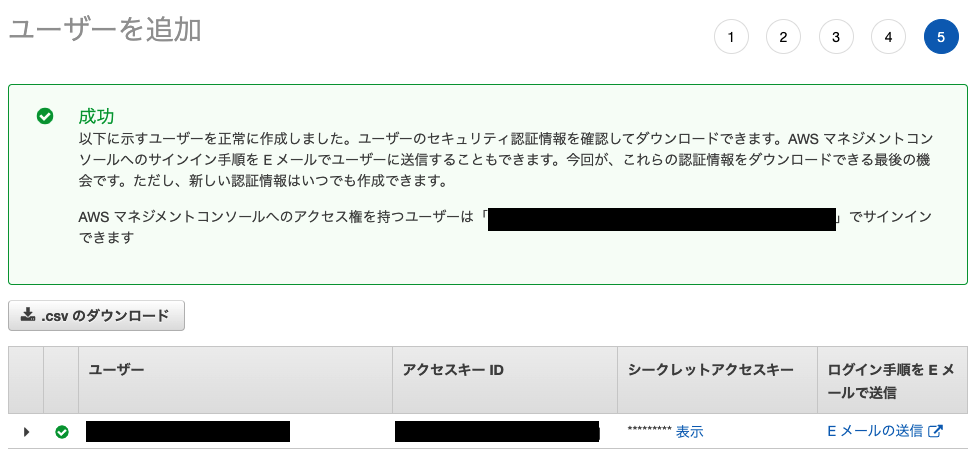

# 2. 実装と問題回答

## ユーザー

### IAM 管理者ユーザーの作成・ログイン（完了）

<aside>
💡 **初回の設定**
ルートアカウントから、IAM管理者ユーザーの請求データへのアクセスを有効化する

</aside>

1. AWS アカウントに管理者グループ（Administors など）をセットアップする
2. Administors グループに AdministorAccess ポリシーをアタッチする
3. IAM ユーザーを作成し、Administors グループに追加する



### PowerUserAccess ポリシーを付与した IAM ユーザーを作成（完了）

**PowerUserAccess の説明**

> Provides full access to AWS services and resources, but does not allow management of Users and groups.

**IAM ダッシュボードでは次のエラーが表示される**

> この操作を実行するために必要な許可がありません。許可を追加するように管理者に依頼してください。

**理由**

PowerUserAccess ポリシーは前述の記載の通り「AWS サービスの全てのリソースにアクセスできるが、ユーザーやグループの管理はできない」ため。

### 問題回答

- ルートアカウントではなく IAM 管理者アカウントでログインする理由
  - 情報漏洩のリスク、情報漏洩時のリスクを少しでも低くするため
- IAM アカウントを使い回すリスク
  - 操作履歴を特定しにくくなる
- AdministorAccess ポリシーと PowerUserAccess ポリシーの違い

  ```json
  // AdministratorAccess
  {
      "Version": "2012-10-17",
      "Statement": [
          {
              "Effect": "Allow",
              "Action": "*",
              "Resource": "*"
          }
      ]
  }

  // PowerUserAccess
  {
      "Version": "2012-10-17",
      "Statement": [
          {
              "Effect": "Allow",
              "NotAction": [
                  "iam:*",
                  "organizations:*",
                  "account:*"
              ],
              "Resource": "*"
          },
          {
              "Effect": "Allow",
              "Action": [
                  "iam:CreateServiceLinkedRole",
                  "iam:DeleteServiceLinkedRole",
                  "iam:ListRoles",
                  "organizations:DescribeOrganization",
                  "account:ListRegions"
              ],
              "Resource": "*"
          }
      ]
  }
  ```

  | ポリシー            | リソース | アクション         |
  | ------------------- | -------- | ------------------ |
  | AdministratorAccess | 全て許可 | 全て許可           |
  | PowerUserAccess     | 全て許可 | 細かく制御している |

- AWS 管理ポリシーとカスタマー管理ポリシーの使い分け
  - 編集不要でよくあるポリシーを付与したい場合は AWS 管理ポリシー
  - 実際のサービス運用で詳細に定義する場合はカスタマー管理ポリシー
    - ほとんどこっち？

## グループ

### Administorators グループの作成・ポリシー付与・ユーザー追加

ユーザーセクションで完了済み

### 問題回答

- ポリシーの直接付与と、グループ付与について

  - AdministratorAccess の場合は、グループによる管理が強く推奨されている

    > AWS アカウントに管理者グループを作成することは必須ではありませんが、強く推奨します。

    [IAM の使用開始](https://docs.aws.amazon.com/ja_jp/IAM/latest/UserGuide/getting-started.html)

  - 変更容易性が一番のメリット

## EC2 から S3 にアクセスできる IAM を作る

### EC2 インスタンスの作成（完了）

### S3 バケットの作成（完了）

### EC2 インスタンスから S3 バケットを操作する

1. `aws cli` をインストール

   [AWS CLI の最新バージョンをインストールまたは更新します。](https://docs.aws.amazon.com/ja_jp/cli/latest/userguide/getting-started-install.html)

2. EC2 に ssh 接続する

   <aside>
   ⚠️ 以下のセットアップでセキュリティグループの設定をミスしておりちょっとはまったので注意

   </aside>

   [Amazon EC2 を使用するようにセットアップする](https://docs.aws.amazon.com/ja_jp/AWSEC2/latest/UserGuide/get-set-up-for-amazon-ec2.html#create-a-base-security-group)

3. S3 バケットの中身を一覧表示するコマンドでエラーになることを確認

   ```bash
   [ec2-user@ip-xxx-xx-xx-xxx ~]$ aws s3 ls s3://praha-challenge-storage
   Unable to locate credentials. You can configure credentials by running "aws configure".
   ```

   [AWS CLI で S3 を操作するコマンド一覧 - Qiita](https://qiita.com/uhooi/items/48ef6ef2b34162988295)

4. 指定の S3 バケットに接続を許可する IAM ポリシーを作成

   ```bash
   {
       "Version": "2012-10-17",
       "Statement": [
           {
               "Sid": "VisualEditor0",
               "Effect": "Allow",
               "Action": "s3:ListBucket",
               "Resource": "arn:aws:s3:::praha-challenge-storage"
           }
       ]
   }
   ```

5. 上記ポリシーを適用したロールを作成
6. 上記ロールを EC2 にアタッチ
7. コマンド実行でエラーが発生しなくなった

[EC2 インスタンスに S3 バケットへのアクセス権を付与する](https://aws.amazon.com/jp/premiumsupport/knowledge-center/ec2-instance-access-s3-bucket/)

### 問題回答

- **EC2 インスタンスにロールを付与すべきか、ポリシーを付与すべきか**

  ポリシーをユーザーに付与するか、グループに付与するかと同じ問題で、ポリシーをグルーピングしたロールを付与することで変更容易性におけるメリットがある

- **リソースベースポリシーとアイデンティティベースポリシーの違い**

  - アイデンティティベース：プリンシパル（ユーザー、アプリケーション、ロール、Federated User）にアタッチする
  - リソースベース：AWS サービスに対して直接アタッチし、プリンシパルで対象を指定できる
  - アイデンティティベースとリソースベースは OR 条件
    - どちらかで許可されていればその権限が有効になる
    - ただしリソースベースポリシー側で明示的な拒否が記述されている場合、拒否の方が優勢になる

  [【IAM 講座 再配信】13 分でロールとポリシーがすんなり分かる！AWS 講座](https://www.youtube.com/watch?v=sOTOIbTMxds)

- **S3 だからこそ気を付けるポイント**

  | 課題                         | 対策                                                                          |
  | ---------------------------- | ----------------------------------------------------------------------------- |
  | 意図せず情報を開示してしまう | IAM による適切な権限管理、VPC ネットワークの理解、Block Public Access、暗号化 |
  | データの不整合が起こる       | IAM による適切な権限管理、データの整合性チェック、バージョニング／Object Lock |
  | 誤ってデータを削除してしまう | バージョニング／Object Lock、MFA Delete                                       |

  **Block Public Access を設定する**

  - アカウント単位もしくはバケット単位で設定可能な「デフォルトでパブリックアクセスを許可しない機能」

  **暗号化を強制する**

  - AWS Key Management Service を使って、S3 バケットに格納するデータを暗号化する
    - ２種類の暗号化がある
      - サーバーサイド暗号化（S3 側で暗号化を行う）
      - クライアントサイド暗号化（アプリケーション側で暗号化したデータを S3 に格納する）

  [Security Best Practices on S3 | AWS Summit Tokyo 2019](https://www.youtube.com/watch?v=G6kEtrFaEAU)

  [アクセスポリシーのガイドライン](https://docs.aws.amazon.com/ja_jp/AmazonS3/latest/userguide/access-policy-alternatives-guidelines.html)
