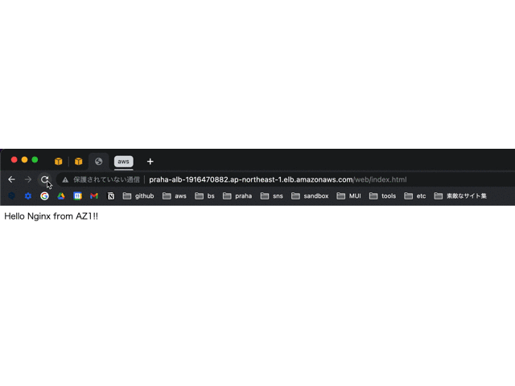
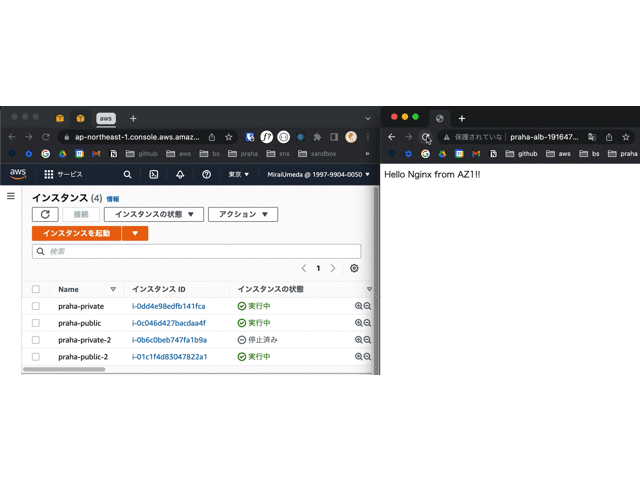

<aside>
💡 #59 で作成したVPCを使用

</aside>

## それぞれの AZ のプラベートサブネットに EC2 インスタンスを構築して Nginx を導入（完了）

- [x] [public] EC2 インスタンスを作成
  - [x] パブリック IP を有効化
  - [x] 現時点でセキュリティグループのインバウンドルールはマイ IP からの SSH 接続のみ許可
- [x] [private] EC2 インスタンスを作成
  - [x] パブリック IP を無効化
  - [x] 現時点でセキュリティグループのインバウンドルールは public サーバーのプライベート IP からの SSH 接続のみ許可
- [x] 多段 SSH をできるように設定

  **設定ファイル**

  ```
  # .ssh/config

  Host praha-public
    HostName 13.230.224.119
    Port 22
    User ec2-user
    IdentityFile ~/aws/public.cer

  Host praha-private
    HostName 10.0.2.122
    Port 22
    User ec2-user
    ProxyCommand ssh praha-public -W %h:%p
    IdentityFile ~/aws/private.cer
  ```

  **ローカルから private サブネットへ接続 OK**

  ```bash
  ❯ ssh praha-private
  Last login: Tue Jul 19 12:09:09 2022 from 10.0.1.233

         __|  __|_  )
         _|  (     /   Amazon Linux 2 AMI
        ___|\___|___|

  https://aws.amazon.com/amazon-linux-2/
  [ec2-user@ip-10-0-2-122 ~]$
  ```

  [踏み台サーバ経由の多段 SSH 接続をローカル端末の秘密鍵のみで実施する | DevelopersIO](https://dev.classmethod.jp/articles/bastion-multi-stage-ssh-only-local-pem/)

- [x] NAT ゲートウェイを追加

    <aside>
    💡 NAT ゲートウェイは、Elastic IP アドレスを送信元 IP アドレスとして使用し、インターネットゲートウェイにトラフィックを送信します。

    </aside>

  - [x] public サブネットに NAT ゲートウェイを作成

    [NAT ゲートウェイ](https://docs.aws.amazon.com/ja_jp/vpc/latest/userguide/vpc-nat-gateway.html#nat-gateway-creating)

  - [x] private サブネットのルートテーブルに、0.0.0.0/0 を NAT ゲートウェイに向ける関連付けを追加

    [NAT ゲートウェイのユースケース](https://docs.aws.amazon.com/ja_jp/vpc/latest/userguide/nat-gateway-scenarios.html#public-nat-gateway-routing)

  - [x] プライベートサブネットからのインターネット接続をテスト（OK）

    ```bash
    [ec2-user@ip-10-0-2-122 ~]$ ping -c 1 google.com
    PING google.com (216.58.220.142) 56(84) bytes of data.
    64 bytes from nrt20s17-in-f14.1e100.net (216.58.220.142): icmp_seq=1 ttl=101 time=4.06 ms

    --- google.com ping statistics ---
    1 packets transmitted, 1 received, 0% packet loss, time 0ms
    rtt min/avg/max/mdev = 4.062/4.062/4.062/0.000 ms
    [ec2-user@ip-10-0-2-122 ~]$
    ```

    [NAT ゲートウェイのユースケース](https://docs.aws.amazon.com/ja_jp/vpc/latest/userguide/nat-gateway-scenarios.html#test-internet-connection)

- [x] Nginx を導入

  - [x] インストール！！

    ```bash
    # 普通にやったら権限不足で怒られた
    [ec2-user@ip-10-0-2-122 ~]$ amazon-linux-extras install nginx1
    You lack permissions to write to system configuration.  /etc/yum.repos.d/amzn2-extras.repo

    # リベンジ（成功）
    [ec2-user@ip-10-0-2-122 ~]$ sudo amazon-linux-extras install nginx1
    Installing nginx
    # 省略...
    [ec2-user@ip-10-0-2-122 ~]$ nginx -v
    nginx version: nginx/1.20.0
    ```

    - `amazon-linux-extras` って何？

      - Amazon Linux 2 には `Extras Library` というパッケージ群が存在する
      - `amazon-linux-extras` コマンド経由でこれらのパッケージを管理する

        - コマンドは 4 つだけ！

          | help    | コマンド一覧を表示する             |
          | ------- | ---------------------------------- |
          | info    | 特定のパッケージの詳細を表示する   |
          | install | パッケージをインストールする       |
          | list    | 利用可能なパッケージ一覧を表示する |

  - [x] 起動

    ```bash
    # 起動
    [ec2-user@ip-10-0-2-122 ~]$ sudo systemctl start nginx.service

    # ステータス確認
    [ec2-user@ip-10-0-2-122 ~]$ systemctl status nginx
    ● nginx.service - The nginx HTTP and reverse proxy server
       Loaded: loaded (/usr/lib/systemd/system/nginx.service; disabled; vendor preset: disabled)
       Active: active (running) since 火 2022-07-19 13:27:52 UTC; 10s ago
      Process: 392 ExecStart=/usr/sbin/nginx (code=exited, status=0/SUCCESS)
      Process: 388 ExecStartPre=/usr/sbin/nginx -t (code=exited, status=0/SUCCESS)
      Process: 387 ExecStartPre=/usr/bin/rm -f /run/nginx.pid (code=exited, status=0/SUCCESS)
     Main PID: 394 (nginx)
       CGroup: /system.slice/nginx.service
               ├─394 nginx: master process /usr/sbin/nginx
               └─395 nginx: worker process

     7月 19 13:27:52 ip-10-0-2-122.ap-northeast-1.compute.internal systemd[1]: Starting The nginx HTTP and reverse proxy server...
     7月 19 13:27:52 ip-10-0-2-122.ap-northeast-1.compute.internal nginx[388]: nginx: the configuration file /etc/nginx/nginx.conf syntax is ok
     7月 19 13:27:52 ip-10-0-2-122.ap-northeast-1.compute.internal nginx[388]: nginx: configuration file /etc/nginx/nginx.conf test is successful
     7月 19 13:27:52 ip-10-0-2-122.ap-northeast-1.compute.internal systemd[1]: Started The nginx HTTP and reverse proxy server.
    [ec2-user@ip-10-0-2-122 ~]$
    ```

    [AWS CLI で EC2 を立てて Nginx を起動する](https://zenn.dev/harasho/articles/5b715500de4c81c83042#nginx%E3%82%92%E3%82%A4%E3%83%B3%E3%82%B9%E3%83%88%E3%83%BC%E3%83%AB%E3%81%97%E3%81%A6%E8%B5%B7%E5%8B%95%E3%81%99%E3%82%8B)

- [x] 上記手順をもう一度実行してマルチ AZ 展開

## それぞれの EC2 インスタンスから別々の HTML ページを返す

```bash
# （AZごとに）公開ディレクトリにHTMLページを作成
[ec2-user@ip-10-0-2-122 ~]$ cd /usr/share/nginx/html
[ec2-user@ip-10-0-2-122 html]$ sudo mkdir web
[ec2-user@ip-10-0-2-122 html]$ cd web
[ec2-user@ip-10-0-2-122 web]$ sudo touch index.html
[ec2-user@ip-10-0-2-122 web]$ sudo vim index.html
```

## ALB（アプリケーションロードバランサー）を設置して、ALB 経由でページにアクセス

> *ロードバランサー*は、クライアントにとって単一の通信先として機能します。このロードバランサーは、受信アプリケーショントラフィックを複数のアベイラビリティーゾーンの複数のターゲット(EC2 インスタンスなど) に分散します。これにより、アプリケーションの可用性が向上します。

**セキュリティーグループの設定**

- [x] ALB 用に「`Alb-sg`」追加 ⇨ HTTP 通信を全許可
- [x] プライベートサブネット用の「`Web-private-sg`」を編集 ⇨ HTTP 通信は `Alb-sg` からのみ許可
- [x] ターゲットグループの作成
- [x] ALB の作成
  - [x] セキュリティグループ `Alb-sg` をアタッチ
  - [x] 接続テスト

[Application Load Balancer の開始方法](https://docs.aws.amazon.com/ja_jp/elasticloadbalancing/latest/application/application-load-balancer-getting-started.html#test-load-balancer)

## ページが切り替わることを確認



## 片方の EC2 インスタンスを停止すると切り替わらなくなることを確認


