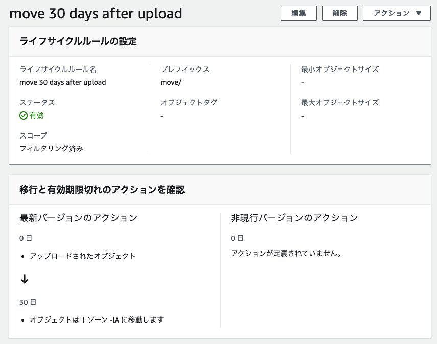
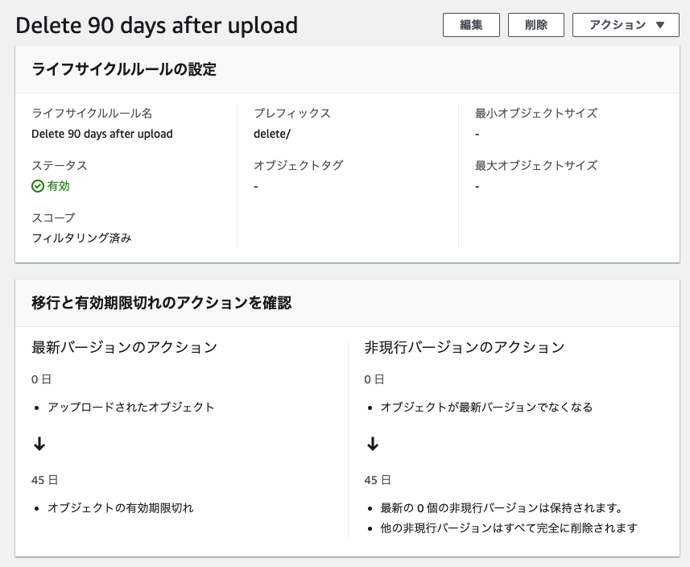

# ストレージクラス

## ストレージクラスの使い分け

| S3 Inteligent-Tiering                                    | アクセスパターンが不明または変化するデータに対して自動的にコストを削減する |
| -------------------------------------------------------- | -------------------------------------------------------------------------- |
| S3 Standard                                              | アクセス頻度の高いデータ向け                                               |
| S3 Standard-Infrequent Access (S3 Standard-IA)           | アクセス頻度の低いデータ向け                                               |
| S3 One Zone-Infrequent Access (S3 One Zone-IA)           | アクセス頻度の低いデータ向け                                               |
| S3 Glacier Instant Retrieval                             | 即時アクセスを必要とするアーカイブデータ向け                               |
| S3 Glacier Flexible Retrieval (旧 S3 Glacier)            | 即時アクセスを必要としないアクセス頻度の低い長期データ向け                 |
| Amazon S3 Glacier Deep Archive (S3 Glacier Deep Archive) | 最も低コストで数時間で取り出し可能な長期アーカイブやデジタル保存向け       |
| S3 Outposts                                              | オンプレミスに S3 データを保存したいとき用                                 |

[Infographic - Amazon S3: Manage and reduce storage costs with Amazon S3 storage classes](https://aws.amazon.com/jp/s3/storage-classes-infographic/)

## ほとんどアクセスされないバケットを作成する場合

1. **`S3 Interigent-Tiering`でいい説**

   > S3 Intelligent-Tiering は、高頻度、低頻度、およびアーカイブインスタントアクセス階層で、頻繁に、稀に、そしてめったにアクセスされないデータ向けに、ミリ秒単位でのレイテンシーと高スループットのパフォーマンスを提供します。

   （↑ 全部やん・・・ただ読み進めていくと）

   > S3 Intelligent-Tiering はアクセスパターンをモニタリングし、30 日間連続してアクセスされなかったオブジェクトを低頻度アクセス階層に移動し、90 日間アクセスがなければ、アーカイブインスタントアクセス階層に移動します。すぐに取り出す必要のないデータの場合、S3 Intelligent-Tiering を設定して、180 日以上アクセスされていないオブジェクトをモニタリングし、自動的にディープアーカイブアクセス階層に移動

   > 低頻度アクセス階層またはアーカイブインスタントアクセス階層にあるオブジェクトに後でアクセスすると、そのオブジェクトは高頻度アクセス階層に自動的に戻されます。

   ほとんどアクセスされないことがあらかじめわかっているならもっとコスパのいいストレージクラスはありそう。

2. `**S3 Standard-Infrequent Access (S3 Standard-IA)`\*\*

   > S3 Standard-IA は、アクセス頻度は低いが、必要に応じてすぐに取り出すことが必要なデータに適しています。

   > S3 Standard-IA は長期保存、バックアップ、災害対策ファイルのデータストアとして理想的です。

   これだ！

3. `**S3 One Zone-Infrequent Access (S3 One Zone-IA)**`

   > S3 1 ゾーン – IA はひとつの AZ にデータを保存するため、S3 標準 – IA よりもコストを 20% 削減できます。

   > S3 標準または S3 標準 – IA のようなアベイラビリティーを必要としないお客様に最適です。

   可用性が低くてもよければこっちの方が 2 より安い！

[ストレージクラス - Amazon S3 ｜ AWS](https://aws.amazon.com/jp/s3/storage-classes/)

## ライフサイクルとは

S3 に保存されるオブジェクトの「保存されてから削除されるまで」の期間のこと。特定の時点で

S3 を別のストレージクラスに移動したり削除するといった「アクション」を実行するためのライフサイクルポリシーを定義できる。アクションは２種類：

| 移行アクション | 別のストレージクラスにオブジェクトを移行するタイミング定義 |
| -------------- | ---------------------------------------------------------- |
| 失効アクション | オブジェクトの有効期限を定義                               |

### 作成から 30 日後に安いストレージクラスに移動するライフサイクルポリシー

- [x] 画像ファイルを S3 に保存する
- [x] ライフサイクルルールを設定（Amazon S3 > バケット > [bucket-name] の管理タブ）

  

### 作成から 90 日後に自動削除するライフサイクルポリシー

- [x] 文書ファイルを S に保存する
- [x] ライフサイクルルールを設定

  

    <aside>
    💬 「最新版の削除」を選択できなかったのは仕様？一度非現行バージョンとしてからでないと削除できない？

    </aside>

### （補足）オブジェクトキーについて

> サブバケットやサブフォルダの階層はありません。ただし、Amazon S3 コンソールで使用されているようなキー名のプレフィックスや区切り記号を使用して論理的な階層を暗示できます。

[オブジェクトキー名の作成](https://docs.aws.amazon.com/ja_jp/AmazonS3/latest/userguide/object-keys.html)

> Amazon S3 の基礎技術は、単純な KVS（Key-Value 型データストア）でしかありません。

[Amazon S3 における「フォルダ」という幻想をぶち壊し、その実体を明らかにする | DevelopersIO](https://dev.classmethod.jp/articles/amazon-s3-folders/)
