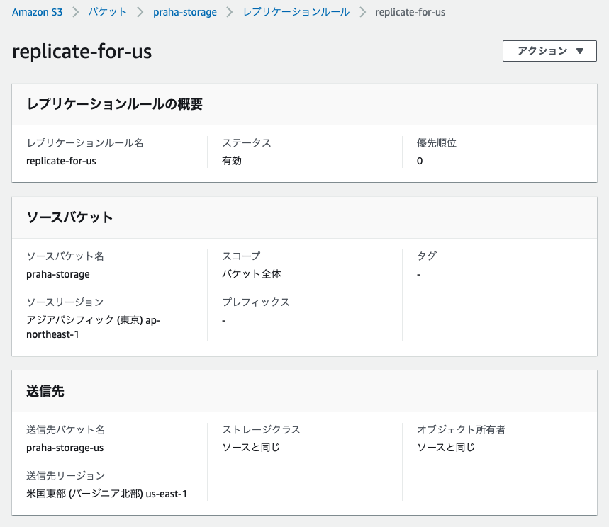

# **バックアップ**

## 「バージョニング」と「レプリケーション」の違い

| 機能名           | 機能                                                                         | 目的                                                     |
| ---------------- | ---------------------------------------------------------------------------- | -------------------------------------------------------- |
| バージョニング   | バケット内に履歴を保存する                                                   | 意図しない操作や障害からの復旧のため                     |
| レプリケーション | 別バケットにオブジェクトを非同期コピーする（異なるアカウントにも送信できる） | クロスリージョンレプリケーション：レイテンシー最小化など |

シングルリージョンレプリケーション：異アカウント間のログ集約、本番環境とテスト環境のデータ同期など |

[オブジェクトのレプリケーション](https://docs.aws.amazon.com/ja_jp/AmazonS3/latest/userguide/replication.html)

## クロスリージョンレプリケーション（CRR）を作成

- [x] レプリケーションルールを作成（Amazon S3 > バケット > [bucket-name] の管理タブ）

  

  [同じアカウントが所有するレプリケート元バケットとレプリケート先バケットのレプリケーションの設定](https://docs.aws.amazon.com/ja_jp/AmazonS3/latest/userguide/replication-walkthrough1.html)

- [x] オブジェクト作成後コピーが作成されていることを確認（OK）

## バージョニング

- [x] バージョニングを有効化した S3 バケットはレプリケーション設定したバケットを使用
- [x] オブジェクトを削除して、削除マーカーが作成されることを確認
- [x] 削除マーカーを削除して、復元を確認（OK）

[削除マーカーの使用](https://docs.aws.amazon.com/ja_jp/AmazonS3/latest/userguide/DeleteMarker.html)
