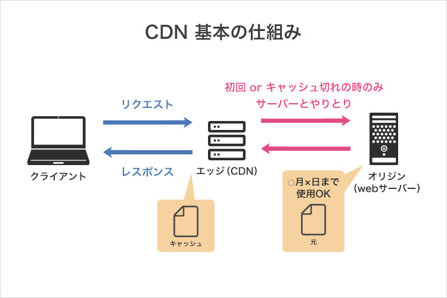

# **課題１：CDN について**

## CDN を使うと負荷分散やパフォーマンス改善に繋がる理由

(↑) どんと来い！サイト高速化【よく聞く CDN の正体とは？なぜ便利？】より参照

- CDN ではエッジサーバーへリクエストを送信する
- さらにエッジサーバーは複数拠点に設置されておりユーザーと近い距離で通信を行える
- エッジサーバーはコンテンツのキャッシュを保持しており有効期限内であればそのキャッシュを返す
  - オリジンサーバーの負荷低減にもなる

<aside>
💡 通信距離の短縮・キャッシュの利用・オリジンサーバーの負荷低減で高速化に繋がる

</aside>

## オリジンサーバとエッジサーバの違い

上述の通り。エッジサーバーはコンテンツをキャッシュしているサーバー。オリジンサーバーはコンテンツを配信している本体サーバー。

## ブラウザキャッシュと CDN の比較

|                                | ブラウザキャッシュ | CDN            |
| ------------------------------ | ------------------ | -------------- |
| 保存場所                       | ブラウザ           | エッジサーバー |
| ユーザー                       | 一人               | 複数           |
| ユーザーによるキャッシュクリア | できる             | できない       |
| 費用                           | 無料               | 有料           |

**CDN のメリット**

- 複数ユーザーで共有するためキャッシュヒット率が高くなる
- ユーザー数がパフォーマスの低下に直結しにくい
- 通信距離の影響が少ない

**CDN のデメリット**

- コスト
- キャッシュ容量が小さく割と更新されるようなデータには向かなそう

**CDN を使った方が良いユースケースを考える**

- ユーザー数の増加が見込まれる
- 通信距離の影響を受ける可能性がある

⇨ 世界展開が予想される比較的大規模なサービス、その中の Static なデータをホスティングするとき
