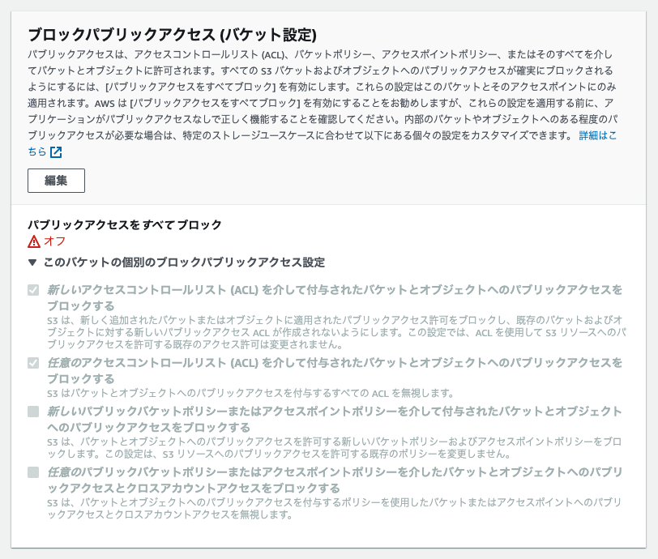

# **課題２：CDN を使ってみる**

## 準備

- [x] 日本から遠いリージョンに画像を保存
- [x] 画像（ `https://{bucket-name}.s3.amazonaws.com/{file-path}` ）が表示されることを確認
- **アクセス権限について**

    <aside>
    ⚠️ 原則パブリックアクセスはすべてブロックする

    </aside>

  URL から表示できなかったので「Amazon S3 > バケット > <bucket-name>」から以下の設定を行なった

  1. ブロックパブリックアクセスの設定：バケットポリシーを有効化

     

  2. バケットポリシーの設定：

     

  [S3 にアップした画像が表示されない - Qiita](https://qiita.com/kt103/items/7642916ba872f9b5893c)

  [Amazon S3 コンソールを使用したバケットポリシーの追加](https://docs.aws.amazon.com/ja_jp/AmazonS3/latest/userguide/add-bucket-policy.html)

## 検証

- [x] 画像を CloudFront 経由で取得できるように設定

  

- [x] CloudFront の URL（ `https://{distribution-domain}/{s3-file-path}` ）から画像を取得できることを確認
- [x] アクセス時間の比較

  |        | S3 から取得 | CloudFront から取得 |
  | ------ | ----------- | ------------------- |
  | 1 回目 | 1110ms      | 124ms               |
  | 2 回目 | 196ms       | 16ms                |
  | 3 回目 | 225ms       | 21ms                |

[簡単な CloudFront ディストリビューションの開始方法](https://docs.aws.amazon.com/ja_jp/AmazonCloudFront/latest/DeveloperGuide/GettingStarted.SimpleDistribution.html)
