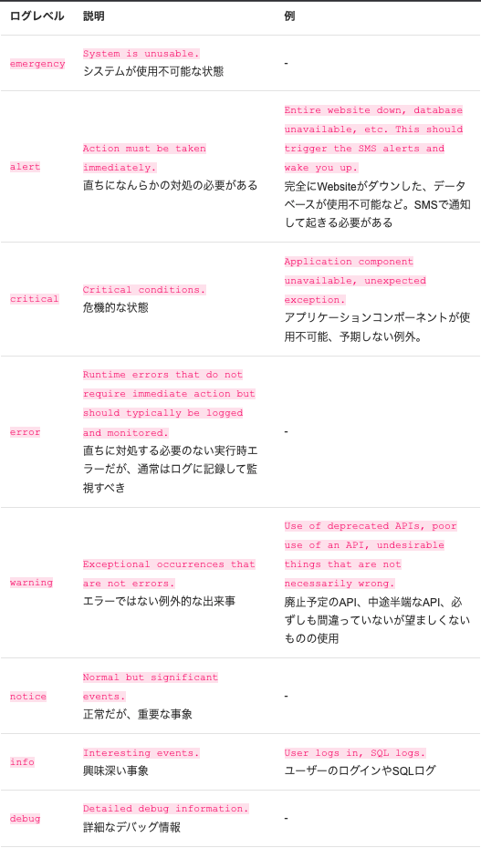
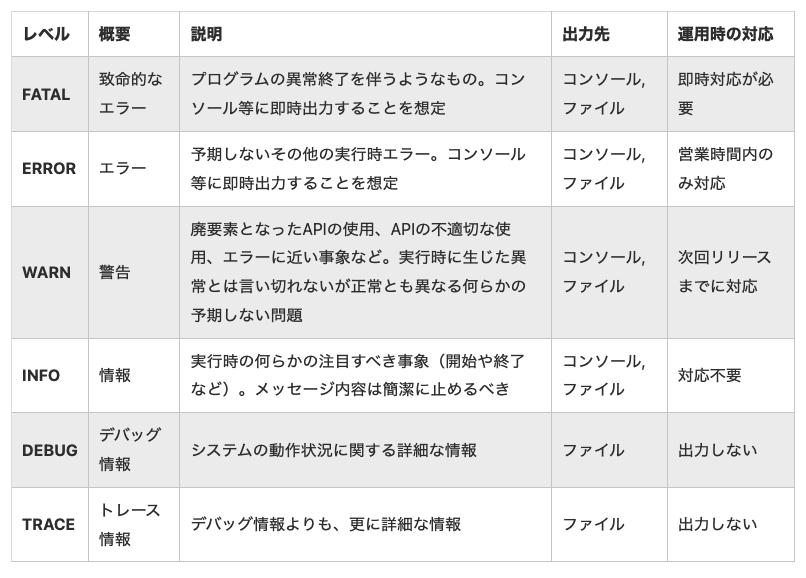
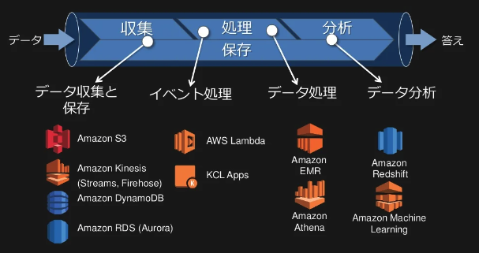

# #63 ログの取り方を学ぼう

# 課題 1：質問

## ログレベルとは

**PHP における PSR-3 の例：**



[fig-standards/PSR-3-logger-interface.md at master · php-fig/fig-standards](./screenshots/log4j-level.png)

[ログレベルちゃんと使い分けてますか？ - OTOBANK Engineering Blog](https://engineering.otobank.co.jp/entry/2016/09/20/181756)

**Log4j の例：**



[ログ設計指針 - Qiita](https://qiita.com/nanasess/items/350e59b29cceb2f122b3)

**ログレベルを指定することで以下の点で整理・分類が可能：**

- 危険度の
- 緊急性
- 通知方法など

## アプリケーションログに含める情報、含めない情報

**含める情報：**

- 収集したい情報を得るために必要な情報
  - ログレベル
  - 時間（開始時間／終了時間）
  - 処理概要
  - 対象処理（クラス名／メソッド名など）
    - 実行条件（パラメーターなど）
  - 処理結果（OK／NG）
    - 例外内容（エラーメッセージなど）

**含めない情報：**

- セキュリティやプライバシーに影響を及ぼす情報
  - パフォーマンスに影響を及ぼす長大な情報
  - 個人を識別する情報（氏名／住所／連絡先など）
  - セキュリティリスクに繋がる情報（セッション ID ／アクセストークンなど）

<aside>
💬 個人情報はプロジェクトのポリシーに準拠して、マスク処理や一方向ハッシュ関数で符号化することも可

</aside>

## ログレベルごとのログ出力タイミング

**冒頭スクショのログレベルの場合：**

| レベル | タイミング                               |
| ------ | ---------------------------------------- |
| FATAL  | イベント発生時                           |
| ERROR  | イベント発生時                           |
| WARN   | イベント発生時                           |
| INFO   | イベント発生時・途中経過・イベント終了時 |
| DEBUG  | 必要に応じて                             |
| TRACE  | 必要に応じて                             |

（ログなんてとったことないよう・・・教えてください・・・ 🥲）

## 自動集計のためのパースしやすいログメッセージとは

適切な区切り文字や記号（ `|` , `#` , `:` など）を使用して「構造化」がされていること

[ログのパース - ベストプラクティス](https://docs.datadoghq.com/ja/logs/guide/log-parsing-best-practice/)

## ログの種類

| 種類                 | 領域           | 説明                                                                         |
| -------------------- | -------------- | ---------------------------------------------------------------------------- |
| アクセスログ         | バックエンド   | 行動を記録する（誰が・いつ・どこから・どのような操作を行い・どうなったのか） |
| アプリケーションログ | バックエンド   | アプリケーションの動作を記録する（ログイン・ログオフ・ファイルアクセスなど） |
| エラーログ           | バックエンド   | エラーを記録する                                                             |
| ユーザーログ         | フロントエンド | ユーザーの操作やページのパフォーマンスを記録する                             |
| クエリログ           | データベース   | SQL の実行内容を記録する                                                     |

[リアルユーザモニタリング（RUM） vs 合成モニタリング: 顧客体験を改善するにはどうしたらいいか](https://newrelic.com/jp/blog/how-to-relic/synthetic-versus-real-user-monitoring)

## ログローテーションについて

> ログローテーションとは、システムが残す時系列の記録データ（ログ）が際限なく増えることを防ぐために、一定の容量や期間ごとに古いログを削除したり新しいログで上書きすること。

[ログローテーションとは - IT 用語辞典](https://e-words.jp/w/%E3%83%AD%E3%82%B0%E3%83%AD%E3%83%BC%E3%83%86%E3%83%BC%E3%82%B7%E3%83%A7%E3%83%B3.html#:~:text=%E3%83%AD%E3%82%B0%E3%83%AD%E3%83%BC%E3%83%86%E3%83%BC%E3%82%B7%E3%83%A7%E3%83%B3%E3%81%A8%E3%81%AF%E3%80%81%E3%82%B7%E3%82%B9%E3%83%86%E3%83%A0,%E3%83%AD%E3%82%B0%E3%81%A7%E4%B8%8A%E6%9B%B8%E3%81%8D%E3%81%99%E3%82%8B%E3%81%93%E3%81%A8%E3%80%82)

**メリット　：**不要なログが削除されてメモリが空く

**デメリット：**重大なログや分析用のログまで削除されてしまう可能性がある

インフラのクラウド化によってメリットが薄れて必要性は減ってきているのだろうなと推測

## アプリケーションサーバーとログサーバーを分ける理由

**パフォーマンスの問題：**

Apache や Nginx だってアプリケーションのリクエストを捌きながらログまで捌くのはしんどい（C10K 問題、メモリリークなど）

**ログを使用する時の問題：**

クラウドインフラの普及でマルチ AZ 展開など冗長化がベストプラクティスとされる中でログがあちこちのサーバーに分散してしまっては、使用上都合が悪い

**権限問題：**

サーバー権限と密結合になっていると困る

**Food for thought：**

- 権限管理どうする？

  ログレベルやログ種類でバケットを分けて保存して、IAM ポリシーで権限付与するなど・・・？

- 閲覧履歴や編集履歴はどうやって確認する？

  AWS であれば、CloudTrail、CloudWatch Logs Insights などで、IAM アイデンティティのアクティビティログをモニタリングできる模様

  [IAM ユーザー、ロール、および AWS アクセスキーのアクティビティを表示する](https://aws.amazon.com/jp/premiumsupport/knowledge-center/view-iam-history/)

- 複数インスタンスのログはどうやって一元管理する？

  CloudWatch Logs などのマネージドサービスが便利らしい

- システムのストレージ容量をログファイルが食い尽くさないか？

  CDN 課題で設定したようなバケットポリシーの自動削除ルールや、ストレージクラスの移行で問題なさそう！

**おまけ：**

AWS でログを収集・管理・分析する場合に使用するサービスが一目でわかりよかった！



[AWS のログ管理ベストプラクティス](https://www.slideshare.net/akuwano/aws-77583244)

## ログ収集方式「プル型」「プッシュ型」について

### プル型（検索型）

監視対象にエージェントをインストールするだけで設定完了。

メリットは設定の簡単さ、デメリットは監視サーバーの負荷が高いこと。

### プッシュ型（通知型）

監視サーバーに監視対象の設定を行う。旧来の監視システムにはこの形式が多い。

メリットは監視対象を一箇所で把握できて異常を発見しやすいこと。デメリットはプル型として設定が多いこと（＝ネットワーク設定が必要になったり、ログ用のエンドポイントを用意しなければならない）。

# 課題 2：質問

**引数をそのままロギングする問題：**

```jsx
function doSomething(input) {
  try {
    // 例外が生じるかもしれない処理
  } catch (e) {
    console.error(e);
    console.log(`引数はこちら: ${JSON.stringify(input)}`);
  }
}
```

- 悪意あるスクリプトをサーバー上で実行されてぶっ壊されてしまうリスク！
- 秘匿性の高い情報が漏洩するリスク！

**対策：**

- WAF の導入
- 入力値をそのままロギングするのは避けること
  - ログを適切に収集（＝分析フェーズまで考慮して適切に構造化）しよう！
