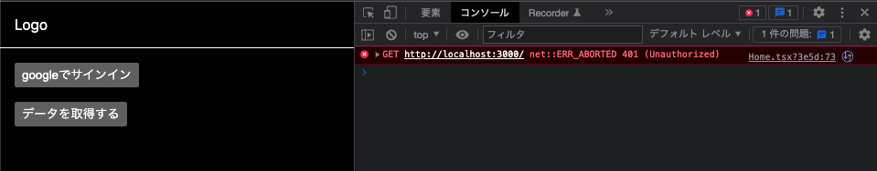
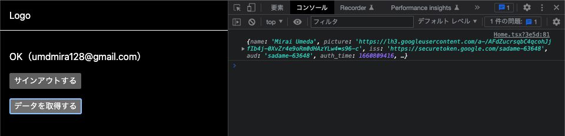

# **課題 1（実装）**

## ユーザーが新規登録／ログインするための画面を作成

[https://github.com/umirai/firebase-frontend](https://github.com/umirai/firebase-frontend)

- [ ] リファクタリングなし
- [ ] firebase-ui は不使用
- [ ] 認証後の再描画・再レンダリングのローディングがややこしかった
  - [ ] iframe を使ったリダイレクトの最適化について理解できていない箇所が結構ある

## API に認可機能を追加

[https://github.com/umirai/firebase-backend](https://github.com/umirai/firebase-backend)

- [ ] DDD 課題ではなく `fastify-cli` で新しく作成した
- [ ] リファクタリングなし
- [ ] [SDK の初期化](https://firebase.google.com/docs/admin/setup#initialize-sdk)に従って実装したため、 `yarn dev` する前に以下を実行しないとけない（めんどくさい）

  ```bash
  export GOOGLE_APPLICATION_CREDENTIALS=~/um/firebase/firebase-backend-admin.json
  ```

- [ ] [`src/routes/root.ts`](https://github.com/umirai/firebase-backend/blob/main/src/routes/root.ts) で firebase のメソッドを呼んでいる箇所は DDD ならインフラ層に隠蔽したい

  ```tsx
  try {
    // ここ
    const result = await firebaseAuth.verifyIdToken(
      request.headers.authorization as string
    );
    reply.code(200).send(result);
  } catch (error) {
    reply.status(401);
  }
  ```

## 有効なアクセストークンがリクエストに含まれない場合は 401 を返す





# **課題 2（質問）**

## アクセストークンとセッションクッキーのメリット・デメリット／使い分け

### （前提１）セッションクッキーとは？

> 指定された ID トークンと引き換えにセッション Cookie を生成する

> HTTP エンドポイントが必要

> トークンをエンドポイントに送信し、Firebase Admin SDK を使用してカスタムのセッション継続時間を設定

> クロスサイト リクエスト フォージェリ（CSRF）攻撃を防止するための適切な措置が必要

```jsx
app.post("/sessionLogin", (req, res) => {
  // idToken と csrfToken を含めたリクエスト取得
  const idToken = req.body.idToken.toString();
  const csrfToken = req.body.csrfToken.toString();

  // CSRF攻撃対策
  if (csrfToken !== req.cookies.csrfToken) {
    res.status(401).send("UNAUTHORIZED REQUEST!");
    return;
  }

  // セッションの有効期限を設定
  const expiresIn = 60 * 60 * 24 * 5 * 1000;

  // セッションクッキーを作成（その過程で idToken の検証も行われる）
  // - セッションクッキーは idToken と同じ calims を持つ（？）
  // - idToken.auth_time をチェックすれば最近のサインイン時のみ許可するなどの制御が可能
  getAuth()
    .createSessionCookie(idToken, {expiresIn})
    .then(
      (sessionCookie) => {
        // クッキーポリシーを設定
        const options = {maxAge: expiresIn, httpOnly: true, secure: true};
        res.cookie("session", sessionCookie, options);
        res.end(JSON.stringify({status: "success"}));
      },
      (error) => {
        res.status(401).send("UNAUTHORIZED REQUEST!");
      }
    );
});
```

[Manage Session Cookies | Firebase Authentication](https://firebase.google.com/docs/auth/admin/manage-cookies#create_session_cookie)

## （前提２）ID トークン？アクセストークン？

|      | ID トークン                          | アスセストークン                                                             |
| ---- | ------------------------------------ | ---------------------------------------------------------------------------- |
| 役割 | 認証に使う                           | 認可に使う                                                                   |
| 詳細 | その人が誰なのかを確認するためのもの | あるリソースに対する権限（read/ write など）を持っているか確認するためのもの |

[【OAuth 2.0 / OIDC】アクセストークンと ID トークンの違い ＋ OIDC 誕生の歴史](https://tech.yyh-gl.dev/blog/id_token_and_access_token/)

## 本題

アスセストークンは認可のため、セッションクッキーは認証のために使うものなので、役割が異なる。おそらく出題意図は、ID トークンとセッションクッキーの使い分けなので、そこを考える。

### ID トークンでの認証

- クライアント側で保存するため、ステートレス（サーバーが状態を変更できない）
- リクエストヘッダーへ JS を使用して追加する
- ログアウト時にストレージからトークンを削除する必要がある
- サーバーがトークンの作成と検証のみを行うため、スケーラブル
- 外部からの悪意あるスクリプトに対して脅威がある
- トークンが外部に漏洩した場合でも、取り消しが困難

### セッションクッキーでの認証

- サーバー側で管理しているので、ステートフル（サーバーが状態を変更しやすい）
- リクエストヘッダーへの追加が自動で行われる
- CSRF、XSS に対して脆弱であり対策が必要
  - `HttpOnly` 属性を指定することで XSS を防ぐことができる
  - `SameSite` 属性を指定することで CSRF を防ぐことができる
- クッキー自体、デフォルトでは単一ドメインで機能するため、フロントエンドとバックエンドでドメインが異なる場合にホワイトリスト登録が必要
- クライアントがブラウザではなくモバイルアプリなどの場合、管理が複雑化するため、クライアントへ公開する API には向いていない
- サーバー側でクッキーを構成するため、ユーザー数が増えていくとスケーラビリティの問題が発生する可能性がある
- クライアントに個別にセッションが保存されるため、大きなデータを扱う場合でもネットワーク使用率が高くならない
- 要件に応じてクッキーポリシーを設定できるため、セキュアになる

### 結論：一長一短

|                        | ID トークンによる認証                  | セッションクッキーによる認証                                        |
| ---------------------- | -------------------------------------- | ------------------------------------------------------------------- |
| 送受信する情報         | ユーザー情報などが暗号化されたトークン | セッション ID                                                       |
| 管理場所               | ブラウザ                               | ブラウザでセッション ID、サーバーでセッション ID に紐づく情報を保存 |
| リクエストへの追加方法 | 手動                                   | 自動                                                                |
| ログアウト時           | 手動で無効化する                       | 自動で無効化する                                                    |
| サーバー負荷           | 低い                                   | 高い                                                                |
| 便利そうな場面         | SPA                                    | SSR                                                                 |

[Web Authentication: Cookies vs. Tokens](https://blog.bitsrc.io/web-authentication-cookies-vs-tokens-8e47d5a96d34)

## アクセストークンが盗まれて不正ログインされてしまった場合の対応

**Firebase の場合：**

（ユーザーの対応）

- パスワードをリセットする

（開発者の対応）

- 更新トークンを取り消す（＝ログアウトされて再認証を求められる）
- セキュリティルールを設定しておく
- IP アドレス制限をしておく

[Manage User Sessions | Firebase Authentication](https://firebase.google.com/docs/auth/admin/manage-sessions)
