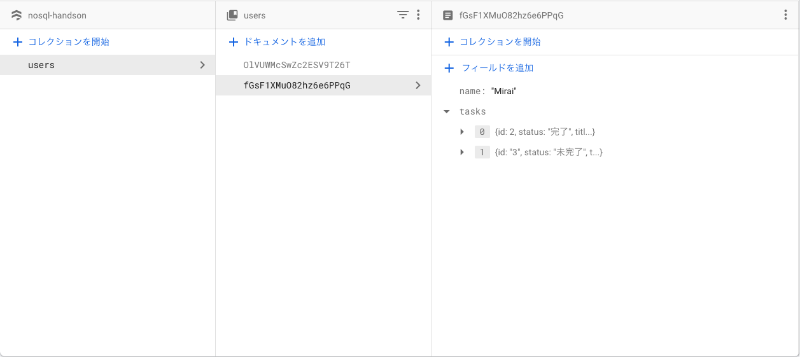

# **課題 1（モデリングと初期データ投入）**

## プラハチャレンジを Firestore でモデリングする（簡略化 Ver）

- ユーザー（はじまったら増えない）
  - 名前
- 課題（多少増減したり、編集が入る可能性があるが、数は多くない）
  - タイトル
- 課題ステータス（随時更新されていく）
  - 未完了
  - 完了

## Step1. まずは正規化

- `users`
  - id
  - name
- `tasks`
  - id
  - title
- `task_status`
  - id
  - value
- `user_task_progress`
  - user_id
  - task_id
  - task_status_id

## Step2. ユースケースの抽出

1. すべてのユーザー（あるいはあるユーザー）の課題進捗状況を取得したい
2. あるユーザーのある課題ステータスを更新したい
3. ある課題を更新したい
4. 課題を削除したい

|                                                   | 処理概要 | 頻度   |
| ------------------------------------------------- | -------- | ------ |
| すべてのユーザーの課題進捗を取得する              | read     | 高     |
| user_id を指定して、課題進捗を取得する            | read     | 高     |
| user_id, task_id を指定して、ステータスを更新する | write    | 中     |
| task_id を指定して、内容を更新する                | write    | 中〜低 |
| task_id を指定して、削除する                      | write    | 低     |

## Step3. データ構造比較検討

|                                           | メリット                                                                                                   | デメリット                                                                   | 想定するユースケース                                                                         |
| ----------------------------------------- | ---------------------------------------------------------------------------------------------------------- | ---------------------------------------------------------------------------- | -------------------------------------------------------------------------------------------- |
| 1. ルートレベルのコレクション             | many-to-many の関係に適している                                                                            | データ増加に伴い取得が難しくなっていく                                       | RDB の正規化に近い                                                                           |
| 2. ドキュメント内にサブコレクションを持つ | サブコレクションが大きくなっても親ドキュメントのサイズが変わらないので、データが時間と共に増えても困らない | サブコレクションの削除が難しい                                               | チャットアプリでルームドキュメントのサブコレクションとしてユーザーコレクションを作成するなど |
| 3. ドキュメント内でネストする             | 固定的なデータを保持する場合に効率が良い                                                                   | スケーラビリティが低い（データが時間と共に増える場合、検索性能に影響が出る） | 「最近閲覧したもの３つ」など上限のあるリストをユーザーに紐づけるなど                         |

今回は高速に MVP を作成するという想定であり、write 系処理の頻度も比較的低そう read-light, write-heavy の方針を選択することにした。データの整合性や更新時のパフォーマンスを担保したい場合は RDB を使用する。

- データの整合性や更新時のパフォーマンスを担保したい場合は RDB を使用する
- [コレクショングループクエリ](https://firebase.google.com/docs/firestore/query-data/queries?hl=ja#collection-group-query)についてしっかり調べて、サブコレクション削除の要件に対応可能そうであれば、２も検討する

## モデリング



# **課題 2（実装）**

Fastify で遊んでいたらルーターがファットになったけど許してください・・・

[https://github.com/umirai/nosql-handson](https://github.com/umirai/nosql-handson)

# **課題 3（質問）**

## **NoSQL における正規化について：**

1. RDB のように正規化を行うパターン

   - 例えば、users に taskIdList を配列で持つなど

     ```tsx
     // 正規化パターン
     {
       name: "ume";
       taskIdList: [1, 2, 3];
     }
     ```

   - メリット　：更新時のデータ整合性を損ないにくい（通常の正規化と同等のメリット）
   - デメリット：クライアントサイドジョインが必要（この場合、taskId の数だけ Firestore にアクセスしなければならない）

2. 非正規化するパターン

   - 例えば、users の tasks を持つなど

     ```tsx
     // 非正規化パターン
     {
       name: "ume";
       tasks: [
         {id: 1, title: "課題1", status: "未完了"},
         {id: 2, title: "課題2", status: "未完了"},
         {id: 3, title: "課題3", status: "未完了"},
       ];
     }
     ```

   - メリット　：課題ステータスへのアクセスが一度で済む（read-light）
   - デメリット：課題更新時の影響範囲が大きい（write-heavy）

### （ポイント）

- ネストしたいデータの更新頻度はどの程度か？
- 更新時の影響はどの程度か？
- 更新時にリアルタイムで更新を反映してほしいのか？どの程度のタイムラグを許容できるか？

**⇨ 更新頻度が低く影響範囲が少ないほど、正規化（パターン１）のメリットは小さく、非正規化（パターン２）のメリットは大きい。更新頻度が高く更新時の影響が大きい場合は、CloudFunctions などで更新を実行するなどの方法がある（ただしサーバーで処理を行うためタイムラグはある）。**

## **RDBMS と NoSQL の比較：**

- パフォーマンス面：NoSQL
  - アプリケーション３層（クライアント、サーバー、DB）において、大量のトラフィックを捌くときにはサーバーと DB に負荷がかかる
  - サーバーはスケールアウトが容易だが、DB はスケールアウトが困難（整合性と可用性を担保することが難しいため）
  - ただし NoSQL であればスケールアウトをサポートしているものがある
  - さらに NoSQL は、非正規化によって read-light を目指す
- データ整合性：RDB
  - 正規化が前提のため
- 設計容易性：RDB
  - RDB では正規化を徹底すればよい。アプリケーション側でクエリの柔軟性を武器に自由に制御可能。
  - NoSQL ではアプリケーションから見て主体的に、ユースケースごとのクエリを重視した設計を行う
  - **RDB は実行時に Join する、NoSQL は設計時に Join するようなイメージ**
  - 実行時の柔軟性を犠牲にしてパフォーマンスをあげるのが NoSQL
- ちょっとだけ違うデータ構造：NoSQL
  - 「だいたい同じだけど部分的に違う」みたいな構造が RDB は苦手
  - NoSQL ではそれが可能になるが、カラム指定の横串検索なんかはできなくなる
- 更新容易性：RDB
  - NoSQL は Atomicity には弱い

[NoSQL のデータ設計を調べて理解が深まったこと](https://zenn.dev/ryokkkke/scraps/c13d07ab1e8b09)

[[Firebase]Firestore の設計の思考法(正規化/非正規化)](https://zenn.dev/t0_inoue/articles/bb3b177f77412e)

[1000 万ユーザに耐えるサーバを作ってみた](https://zenn.dev/higashimura/articles/74c6e6bf63a133#dynamodb%E3%81%A8%E3%81%AF)
